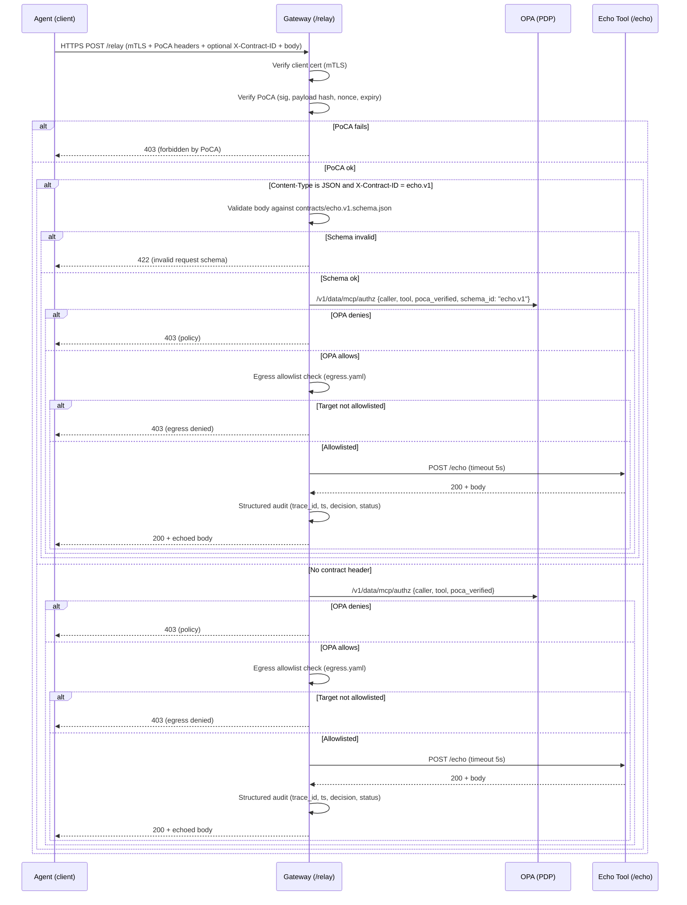

# zt-sanctum

A minimal Zero-Trust (ZT) gateway with PoCA (Proof-of-Context Access) and OPA policy checks.
It sits between an agent (client) and backend tools (an “echo” tool for now), enforcing mTLS identity, PoCA integrity, policy allow/deny, safety limits, and structured auditing.

## Workflow



## Components
- Gateway (Go)
- GET /healthz
- POST /relay (PEP): mTLS client auth, PoCA verification, OPA query, body size cap (2 MiB), upstream timeout (5s), audit JSONL.
- OPA (PDP)
- Evaluates Rego policy on { caller, tool, poca_verified, trace_id }.
- Echo Tool (Go)
- /healthz, /echo (echoes JSON or text; 1 MiB cap, POST-only).
- PoCA Signer (Go helper)
- Emits X-PoCA-Manifest + X-PoCA-Signature for a given payload.
- PKI / PoCA Keys
- mTLS CA/server/client certs; Ed25519 public key(s) for PoCA verification.
- Audit
- Line-delimited JSON at logs/audit.jsonl + stdout.

## Repository layout

```
zt-sanctum/
├─ cmd/
│  └─ gateway/
│     └─ main.go                # mTLS, PoCA verify, OPA call, limits, audit, contract-aware schema check
├─ contracts/
│  └─ echo.v1.schema.json       # JSON-Schema for echo tool
├─ internal/
│  ├─ poca/
│  │  └─ verify.go              # PoCA manifest/nonce/sig/exp verification
│  └─ pki/
│     └─ load.go                # agents.yaml loader (Ed25519 pubkeys)
├─ policy/
│  └─ mcp/
│     └─ authz.rego             # OPA v1 syntax policy
├─ tools/
│  ├─ echo/
│  │  ├─ main.go                # /healthz, /echo
│  │  └─ Dockerfile
│  └─ poca_sign/
│     └─ main.go                # emits PoCA headers for a payload
├─ tests/
│  └─ e2e.sh                    # end-to-end tests (PoCA, replay, schema, egress)
├─ egress.yaml                  # outbound allowlist
├─ pki/
│  ├─ agent.key                 # Ed25519 private (local dev only)
│  ├─ agent.pub                 # Ed25519 public (PEM)
│  └─ agents.yaml               # PoCA verifier pubkeys (base64url raw)
├─ resources/
│  └─ SanctumLogo.png
├─ certs/                       # dev CA/server/client certs (gitignored)
├─ logs/                        # audit.jsonl lives here
├─ Dockerfile.gateway
├─ docker-compose.yaml
└─ readme.md
```

## Quickstart

1) Generate dev TLS certs (mTLS)

From the repo root:

```
mkdir -p certs
openssl req -x509 -newkey rsa:4096 -nodes -keyout certs/ca.key -out certs/ca.crt -subj "/CN=CA" -days 365
openssl req -newkey rsa:4096 -nodes -keyout certs/server.key -out certs/server.csr -subj "/CN=gateway"
openssl x509 -req -in certs/server.csr -CA certs/ca.crt -CAkey certs/ca.key -CAcreateserial -out certs/server.crt -days 365
openssl req -newkey rsa:4096 -nodes -keyout certs/client.key -out certs/client.csr -subj "/CN=agent"
openssl x509 -req -in certs/client.csr -CA certs/ca.crt -CAkey certs/ca.key -CAcreateserial -out certs/client.crt -days 365
```

These are for local development only. Do not commit to VCS.

2) Generate PoCA keys and register the agent pubkey

```
mkdir -p pki
# Ed25519 private/public pair (PEM)
openssl genpkey -algorithm Ed25519 -out pki/agent.key
openssl pkey -in pki/agent.key -pubout -out pki/agent.pub
```

Extract the raw 32-byte public key in base64url and put it into pki/agents.yaml:

```
agents:
  agent:
    ed25519_pubkey_b64: "<base64url raw 32-byte ed25519 pubkey>"
```
(You can produce the base64url with a small helper; see the repo’s tools/poca_sign or use a short Python snippet with cryptography.)

3) OPA policy (v1 syntax)

```
policy/mcp/authz.rego:

package mcp.authz

default allow := false
default reason := []

# Minimal allowlist: only CN "agent" can call tool "echo" and PoCA must be verified.
allow if {
  input.caller == "agent"
  input.tool == "echo"
  input.poca_verified == true
}

reason := ["not allowed"] if {
  not allow
}
```

4) Run everything


```
docker compose up --build
# or: docker compose up -d
```

Check logs:

```
docker compose logs -f gateway
docker compose logs -f opa
docker compose logs -f echo
```

On Apple Silicon, if OPA pulls an amd64 image, add platform: linux/arm64 under the opa service in docker-compose.yaml.

## Make a signed request (PoCA happy path)

1) Build the PoCA signer

```
(cd tools/poca_sign && go build -o poca_sign)
```

2) Generate headers for a payload

```
./tools/poca_sign/poca_sign -key pki/agent.key > /tmp/poca.txt
MAN=$(grep '^X-PoCA-Manifest:'  /tmp/poca.txt | sed 's/^X-PoCA-Manifest: //')
SIG=$(grep '^X-PoCA-Signature:' /tmp/poca.txt | sed 's/^X-PoCA-Signature: //')
BODY=$(grep '^Body:'            /tmp/poca.txt | sed 's/^Body: //')
```

3) Call the gateway

```
curl -k https://localhost:8443/relay \
  --cert certs/client.crt \
  --key  certs/client.key \
  --cacert certs/ca.crt \
  -H "Content-Type: application/json" \
  -H "X-PoCA-Manifest: $MAN" \
  -H "X-PoCA-Signature: $SIG" \
  -d "$BODY"
```

Expected: the echo response.

4) See the audit

```
tail -n 20 logs/audit.jsonl
```

Each entry includes: trace_id, ts, caller, tool, decision, status, optional reason.

🔐 Security model (current)
- Identity: mTLS client certs (CN → caller).
- Integrity (PoCA-lite): Ed25519 signature over the base64url-encoded manifest; payload SHA-256 matches body; nonce replay protection; expiry enforced.
- Authorization: OPA Rego rules (ABAC) on {caller, tool, poca_verified, trace_id}.
- Safety: Request body cap (2 MiB), upstream timeout (5s), OPA timeout (3s).
- Audit: Structured JSONL + stdout.

## Configuration

Environment variables on the gateway:

Var	Default	Description
OPA_URL	http://opa:8181/v1/data/mcp/authz	OPA data API endpoint
BACKEND_URL	http://echo:8081/echo	Upstream tool endpoint (MVP)
AUDIT_PATH	/var/log/zt-gateway/audit.jsonl	Audit JSONL path
POCA_REQUIRED	true	If true, reject requests without valid PoCA
POCA_AGENTS_PATH	/app/pki/agents.yaml	Agents public keys mapping

Volumes in docker-compose.yaml:
  - ./certs:/certs:ro                 # mTLS certs (CA, server, client)
  - ./policy:/policy:ro               # OPA Rego policies
  - ./logs:/var/log/zt-gateway        # structured JSONL audits
  - ./pki:/app/pki:ro                 # Ed25519 pubkeys for PoCA agents

## Troubleshooting
- 403 “forbidden by PoCA”:
Check logs/audit.jsonl for reason:
- poca_unknown_caller_pubkey → fix pki/agents.yaml and restart gateway.
- poca_payload_hash_mismatch → regenerate headers after finalizing the body.
- poca_replay → regenerate (new random nonce each request).
- poca_expired → increase -expmin when signing.
- poca_sig_invalid / poca_manifest_b64_decode → ensure headers are unmodified.
- OPA denies but PoCA passes:
Tail OPA logs and verify policy. Test directly:

```
curl -s http://localhost:8181/v1/data/mcp/authz \
  -H 'Content-Type: application/json' \
  -d '{"input":{"caller":"agent","tool":"echo","poca_verified":true}}'
```

- Docker platform warning (Apple Silicon):
Set platform: linux/arm64 for the opa service.
- zsh parse errors:
Avoid adding comments to lines that end with \. Keep comments on separate lines.

## Roadmap 
	1.	Egress allowlist (deny-by-default) — YAML of allowed upstreams (+ optional TLS pin/SPIFFE ID).
	2.	Request JSON-Schema — validate input per tool; pass schema_id to OPA.
	3.	Tamper-evident audit — add prev_hash and record_hash to chain entries.
	4.	Router + tool registry — accept {tool, payload} envelope and route by tools.yaml.
	5.	SPIFFE/SPIRE — replace static certs with workload SVIDs; use SPIFFE IDs in PoCA/OPA.
	6.	Vault-backed secrets — broker short-lived creds server-side.
	7.	Content trust — pin image digests now; later verify with Sigstore/Cosign.
	8.	Observability — OpenTelemetry spans; Jaeger/Tempo in compose.
	9.	DLP & prompt-injection guards — light regex masks; controlled response filters.

## Disclaimer

This repository is an MVP for learning and scaffolding Zero-Trust patterns. Keys and certs are for local development only. Review, harden, and integrate with your organization’s PKI, identity, secrets, and compliance standards before production use.


